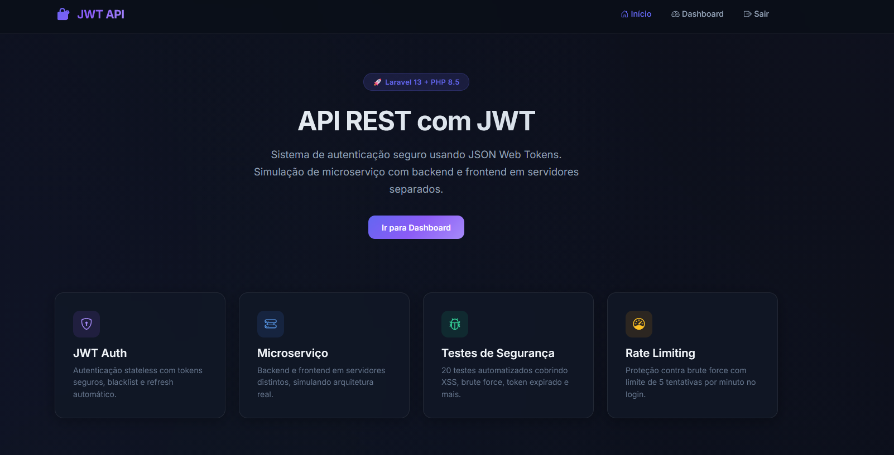
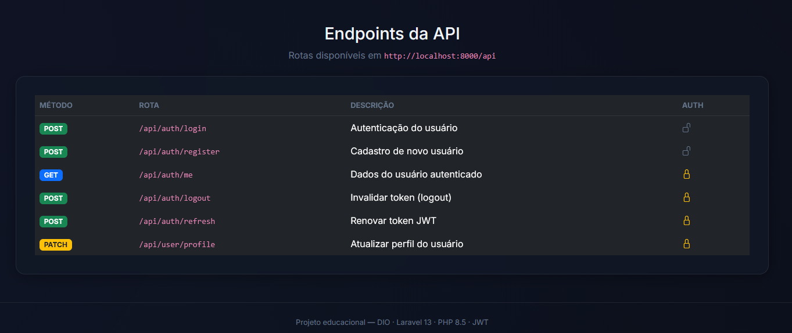
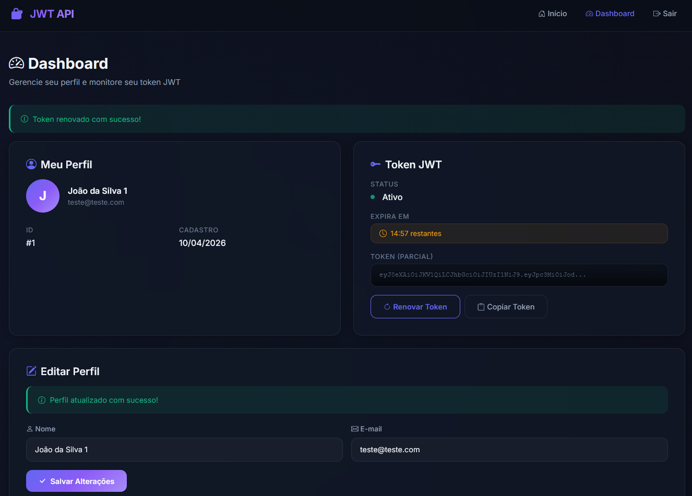
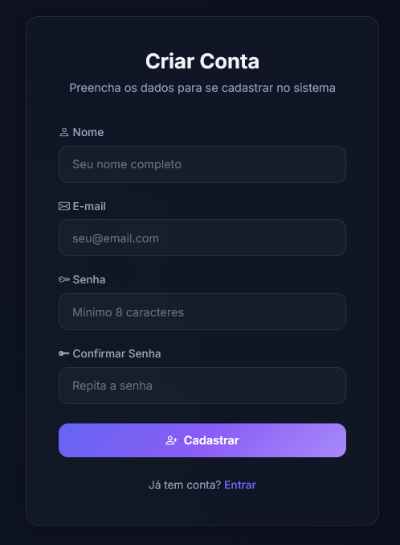
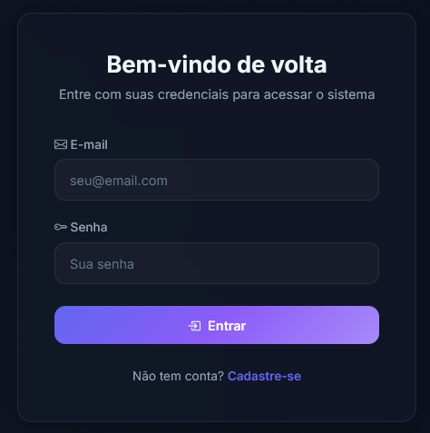

# 🔐 API de Controle de Usuários com Autenticação JWT

Este projeto consiste em uma implementação de API para cadastro e controle de usuários utilizando tokens JWT (JSON Web Token). A base do projeto foi inspirada no desafio **"Construindo uma API com Laravel para Cadastro e Controle de Usuários Utilizando JWT"** da [DIO](https://www.dio.me/projects/construindo-uma-api-com-laravel-para-cadastro-e-controle-de-usuarios-utilizando-jwt), com diversas atualizações técnicas e estruturais.

## 🛠️ Tecnologias Utilizadas

- **Backend**: Laravel 13 e PHP 8.5.
- **Banco de Dados**: MySQL (WampServer).
- **Autenticação**: JWT através do pacote `php-open-source-saver/jwt-auth`.
- **Frontend**: HTML5, CSS3, JavaScript (Vanilla) e Bootstrap 5.3.

## 🏗️ Arquitetura Full Stack

O projeto segue o modelo de desacoplamento entre Backend e Frontend:

1.  **Backend (API)**: Localizado no diretório `/back-end/`. Atua como um servidor RESTful que processa as requisições, valida dados e gerencia a persistência no banco de dados.
2.  **Frontend (SPA Lite)**: Localizado no diretório `/front-end/`. Consome os endpoints da API via Fetch API. O gerenciamento do estado de login é feito através do `LocalStorage`, armazenando o token e controlando o tempo de expiração no lado do cliente.

## ⚡ Diferenciais e Implementações Técnicas

- **Compatibilidade**: PHP 8.5 e Laravel 13.
- **Segurança**: Configuração de CORS para permitir comunicações entre diferentes origens (ex: frontend no Live Server e backend no Artisan).
- **Tratamento de Exceções**: Retornos customizados em formato JSON para erros de autenticação (401), rotas não encontradas (404) e métodos HTTP incorretos (405).
- **Interface**: Dashboard responsiva com monitoramento do tempo restante de validade do token JWT.

## 🧪 Cobertura de Testes e Segurança

O projeto conta com uma bateria de **testes automatizados (Feature Tests)** que garantem a integridade e a segurança da API contra vetores comuns de ataque:

- **Proteção Brute Force**: Implementação de *Rate Limiting* que bloqueia tentativas de login após 5 falhas consecutivas em 1 minuto.
- **Prevenção de SQL Injection**: Uso rigoroso de *Prepared Statements* via Eloquent ORM.
- **Mitigação de XSS**: Proteção através de cabeçalhos de resposta `application/json` e sanitização de saída no frontend.
- **Proteção contra Mass Assignment**: Bloqueio de campos sensíveis (como `id` ou `is_admin`) em requisições de atualização de perfil.

## 🔒 Segurança por Design (Stateless)

Diferente de sistemas convencionais, esta API não utiliza IDs expostos nas URLs (ex: `/api/user/10`) para operações do usuário logado. 

- **Identificação via Token**: O sistema identifica o usuário exclusivamente através do *payload* criptografado do **Bearer Token**.
- **Isolamento**: Um usuário nunca consegue acessar ou modificar dados de outro, pois a API ignora IDs enviados no corpo da requisição e utiliza apenas o ID contido na assinatura digital do JWT.

---

## 🛠️ Detalhamento dos Endpoints

Todas as rotas possuem o prefixo base `http://localhost:8000/api`.

### Autenticação (Públicas)

| Rota | Método | Parâmetros (JSON) | Descrição |
| --- | --- | --- | --- |
| `/auth/register` | `POST` | `name`, `email`, `password`, `password_confirmation` | Cria um novo usuário no banco de dados. |
| `/auth/login` | `POST` | `email`, `password` | Autentica o usuário e retorna o `access_token` JWT. |

### Gerenciamento (Protegidas)
*Requerem o cabeçalho: `Authorization: Bearer {seu_token}`*

| Rota | Método | Parâmetros (JSON) | Descrição |
| --- | --- | --- | --- |
| `/auth/me` | `GET` | — | Retorna os dados completos do objeto do usuário logado. |
| `/auth/refresh` | `POST` | — | Invalida o token atual e gera um novo (mecanismo de renovação). |
| `/auth/logout` | `POST` | — | Invalida o token atual e encerra a sessão da API. |
| `/user/profile` | `PATCH` | `name`, `email` | Atualiza os dados do perfil do usuário autenticado. |

---

## 🚀 Instruções para Execução

### Backend
1. Navegue até a pasta `back-end`.
2. Execute `composer install` para instalar as dependências.
3. Configure o arquivo `.env` com as credenciais do MySQL.
4. Execute as migrations: `php artisan migrate`.
5. Inicie o servidor: `php artisan serve` (padrão porta 8000).

### Frontend
1. Navegue até a pasta `front-end`.
2. Inicie um servidor local (ex: Live Server do VS Code) a partir do arquivo `index.html`.
3. O acesso padrão sugerido é `http://127.0.0.1:5500`.

### 🧪 Testes de API (Postman)
Para validação independente dos endpoints, utilize o Postman com os seguintes cabeçalhos nas rotas protegidas:
- `Accept: application/json`
- `Content-Type: application/json`
- `Authorization: Bearer {seu_token}`

## 📸 Capturas de Tela

Abaixo estão as visualizações das principais interfaces do sistema:

| Tela | Visualização |
| --- | --- |
| **Página Inicial** |  |
| **Documentação de Endpoints** |  |
| **Dashboard do Usuário** |  |
| **Cadastro de Usuário** |  |
| **Login do Sistema** |  |

## 🔮 Sugestões de Melhorias

O projeto pode ser expandido com as seguintes funcionalidades:
- **RBAC (Role-Based Access Control)**: Implementação de colunas como `is_admin` para permitir que administradores gerenciem (editem/excluam) dados de outros usuários.
- **Inativação de Conta (Soft Deletes)**: Substituição da exclusão física de registros por uma coluna de status (ativo/inativo), permitindo a retenção de dados históricos.
- **Sistema de Log**: Registro de atividades administrativas para auditoria.
